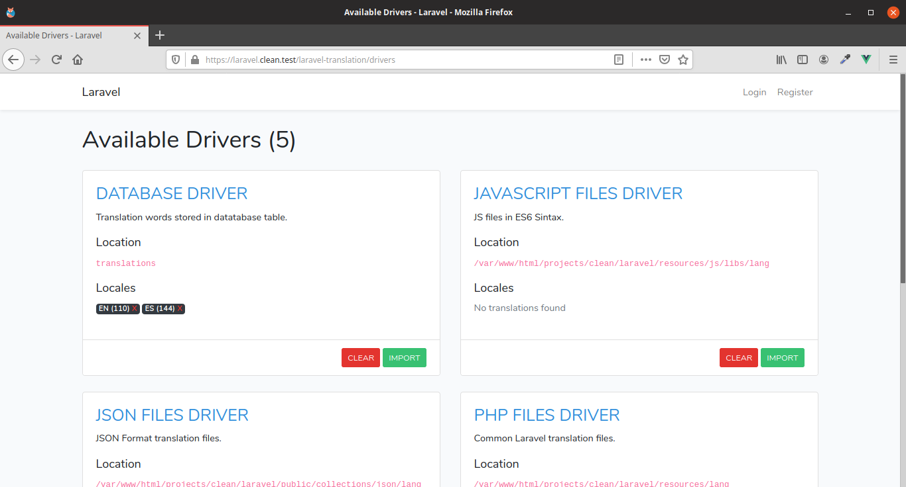

# Laravel Translations

Store your translation files in different formats (database, json, js, xml, php ) with a single command.

We know it, Laravel is very powerfull and the titan in Php Frameworks; however, some consistence in it is very squishy, for example, Translations.

You have a single files for translations and you can edit it simply and faster, but... When you make a SPA ? Vue app? Where stay a robust interface to manage translations? This is the start of the problem.

We create an easy commands to manipulate translations in different formats and generated a simple class (Vanilla JS and Vue.js at the moment) to load it in frontend apps.

Thats is all, format conversions and single functions to translate in front, who needs more with Laravel?

## Another "db translations" for Laravel?

No, never.

Some libraries (well, the vast majority) offers to you a bridge to use Db in Translations (in some cases it will replaces Laravel translation) + any loader + some things and bumb: another db translations library.

We offers  next level of "comfort" : Manage all the translations of you need and enjoy all the "things" to do with that.

## Installation

You can install the package via composer:

```bash
composer require sluy/laravel-translation
```

You could publish migrations, configuration and translations for views with:

```bash
php artisan vendor:publish --provider="Sluy\LaravelTranslation\LaravelTranslationServiceProvider"
```

## Configuration

With some configurations (or none in many cases) you can perform all package functions:

```php
//config/laravel-translation.php
<?php return [
    // Determines if language will be autodetected on request.
    // If this option are enabled it will use 'Accept-Language' http header
    // to lookup. 
    'autodetect_language' => true,
    // An array with package drivers.
    'drivers' => [
        // Db driver: Store/Retrieve data from Database.
        'db' => [
            'class' => Sluy\LaravelTranslation\Drivers\Common\DbDriver::class,
            'location' => 'translations', // Default table to work
            'connection' => null, // null for default connection
        ],
        // Php driver: Store/Retrieve data from default Laravel php location files.
        'php' => [
            'class' => Sluy\LaravelTranslation\Drivers\Common\PhpDriver::class,
            'location' => resource_path('lang'),
        ],
        // JS driver: Store/Retrieve data in Js Modules format. Common of VanillaJs/VueJS
        // apps works with this
        'js' => [
            'class' => Sluy\LaravelTranslation\Drivers\Common\JsDriver::class,
            'location' => storage_path('laravel_translation/lang/js'),
            // determines if will generate index.js files when store/delete items
            'generate_index' => true,
             // determines if npm will reload files when store/delete items
            'npm_reload' => true,
        ],
        // Json driver: Store/Retrieve data in JSON format. You can perform, for example,
        // remote fetches of translations.
        'json' => [
            'class' => Sluy\LaravelTranslation\Drivers\Common\JsonDriver::class,
            'location' => storage_path('laravel_translation/lang/json'),
        ],
        // Xml driver: Store/Retrieve data in XML format. Yes, we know, XML doesnt seems
        // like a "popular" format, but it have too!.
        'xml' => [
            'class' => Sluy\LaravelTranslation\Drivers\Common\XmlDriver::class,
            'location' => storage_path('laravel_translation/lang/xml'),
        ],
    ],
];
```


## Commands

---

### Importing/Exporting translations

Common way to generate translations in multiple formats. Basically from one formato to another format, thats is all.

```bash
php artisan laravel-translation:import {src_driver} {dst_driver} --locale=  --dst_location= --src_location=
```

Basically, we have this:

| name           |                                                              | required |
| -------------- | ------------------------------------------------------------ | -------- |
| `dst_driver`   | Name of destination driver.                                  | yes      |
| `src_driver`   | Name of source driver.                                       | yes      |
| `locale`       | Locales to export (separated with comma). If this value doesnt setted, it will export all languages. | no       |
| `dst_location` | Location of Destination driver data. If this value doesnt setted, it will take automatically location setted for the driver in `config/laravel-translation.php` file. | no       |
| `src_location` | Location of Source driver data. If this value doesnt setted, it will take automatically location setted for the driver in `config/laravel-translation.php` file. | no       |


**Example** 

```bash
php artisan laravel-translation:import {db} {php} --locale=es,en --dst_location=my_custom_translations src_location=/my_custom_folder/php  
```

It will import PHP files in `/my_custom_folder/php` to Database table called `my_custom_translations`. 

### Destroying translations

You can destroy any translation resource exporting alike:

```bash
php artisan laravel-translation:destroy {driver} -locale=  --location=
```

Basically, we have this:

| name     |                                                              | required |
| -------- | ------------------------------------------------------------ | -------- |
| `driver` | Name of driver.                                              | yes      |
| `locale` | Locales to delete (separated with comma). If this value doesnt setted, it will delete all languages resources from driver. | no       |
| location | Location of driver resources. If this value doesnt setted, it will take automatically location setted for the driver in `config/laravel-translation.php` file. | no       |

**Example** 

```bash
php artisan laravel-translation:destroy {json} --locale=es --location=/my_custom_folder/json  
```

It will destroy es locales in `/my_custom_folder/json`.

## GUI Administration

Our package includes all in one GUI to do all command things (and a little bit more) with a graphical interface.

### Adding views

You can and GUI views with artisan command:

```bash
php artisan laravel-translation:views {format} --rewrite=true/false
```

| name      | description                                                  | required |
| --------- | ------------------------------------------------------------ | -------- |
| `format`  | Format of view markup. You can set as:<br />`html` : Standalone GUI Version. It includes bootstrap markup included with cdn source.<br />`bootstrap`: Uses **laravel ui** boostrap templates. Extends `app.layout` automatically. | yes      |
| `rewrite` | Determines if view files will be rewriten if exists. Default `false` | no       |

GUI Views are stored in `resources/vendor/laravel-translation` path and resets Laravel View Cache automatically.

**Example**


```bash
php artisan laravel-translation:views html --rewrite=true  
```

### Adding routes

To add package routes type in your project root:

```bash
php artisan laravel-translation:routes
```

It will add all needed routes to your `web.php` and `api.php` 

If you want to deploy `web` or `api` routes only, you can define `only` optional parameter:

```bash
php artisan laravel-translation:routes --only=web #only deploys "web" routes

php artisan laravel-translation:routes --only=api #only deploys "api" routes
```


### Web Manager

#### Driver Management

 `laravel-translation/drivers`  route will show all administrative topics for your defined drivers




Basically, it show available drivers in boxes with:

- Driver name
- Driver info
- Location of "store" resource
- Current loaded locales (with x control to remove module locale translations)
- Actions
  - import : Open import interface.
  - clear: To remove all translations.


#### Importing Data

 `laravel-translation/drivers/{driver}`  route will allow to import translations to current `{driver}`.


First of all, you will need to choose if you want an importation from another driver or an upload.

##### From another Driver


After choosing `Another Driver` option, it will show you another necessary controls:

- Source: Defines source driver to import data.
- Locales: Check desired locales to import.

##### From upload 

Yes, you can upload  translations from your computer! 


When you pick `Upload` options, it will needs to fill:

- **Source:** Source format (aka driver) of upload.
- **File to upload:** A zip file with all the translations structure. Translation structure is the same thing than [Laravel](https://laravel.io) translation folder `resources/lang`. 

## Helpers

### Javascript Helper

You can add a simple helper to translate directly in Javascript (very usefull in SPA development):

```bash
php artisan laravel-translation:helpers js --bootstrap=true/false
```

**boostrap** option will determines if you want to add automatically helper in `resources/js/bootstrap.js` file. By default their value is `false`.

After typing javascript helper installer command (and added it in bootstrap) you can easily translate words:

```javascript
__('your.keyword', {replace1: 'value1', replace2: 'value2', ...});
```


### VueJS Extension

We does not forgot lovely VueJS framework. You can add VueJS helper with command:

First at all, you need to install **Javascript Helper** to works with **Vue Extension**:

```bash
php artisan laravel-translation:helpers js --bootstrap=true
```

After that,  install **Vue Extension** :

```bash
php artisan laravel-translation:helpers vue --bootstrap=true/false
```
As in previous case, **boostrap** option will determines if you want to add automatically helper in `resources/js/bootstrap.js` file. By default their value is `false`.

After installing VueJS helper, you can use translations inside templates:


```html
<template>
    <div>
        <div>
        	{{__('your.keyword')}}
        </div>
    </div>
</template>
```
Or inside logic definition:

```javascript
export default {
	mounted () {
		this.__('your.keyword');
	}
}
```
Additionally, VueJS Extension injects a directive to translate directly in your templates:

```html
<template>
    <div>
        <div v-trans="'your.keyword'"></div>
        <!-- or... -->
        <div trans>your.keyword</div>
    </div>
</template>
```


## Additional Notes

### Give Right privileges to Driver files/folders location

Remember to provide read/write access to driver or it will fires access errors.

For example with **PHP Driver**:

```bash
sudo chown -R youruser:www-data resources/lang
sudo chmod -R 775 resources/lang
```


## Changelog

Please see [CHANGELOG](CHANGELOG.md) for more information what has changed recently.

## Contributing

Please see [CONTRIBUTING](CONTRIBUTING.md) for details.

### Security

If you discover any security related issues, please email sluy1283@gmail.com instead of using the issue tracker.

## Credits

-   [Stefan Luy](https://github.com/sluy)
-   [All Contributors](../../contributors)

## License

The MIT License (MIT). Please see [License File](LICENSE.md) for more information.
